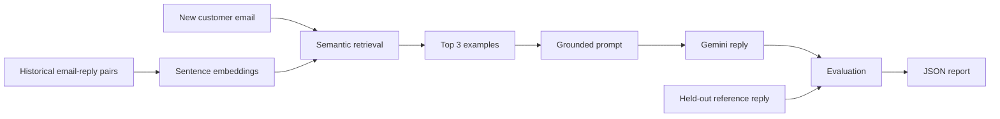

# Email Evaluator

A retrieval-grounded customer-support reply generator with an evaluation pipeline for semantic quality, practical email structure, safety, and LLM-based review.

## What it demonstrates

- Separation of historical retrieval data from held-out evaluation examples
- In-memory semantic retrieval with Sentence Transformers and cosine similarity
- Prompt construction from the three nearest historical email-reply pairs
- Gemini-based response generation
- Evaluation across semantic similarity, rule checks, safety heuristics, and LLM-as-a-judge
- Per-example JSON reports with interpretable component scores

## Architecture



## Evaluation design

Each generated reply receives four component scores:

- **Semantic similarity:** embedding similarity to the held-out reference reply
- **Rule checks:** greeting, closing, length, and placeholder checks
- **Safety checks:** heuristics for unsupported tracking numbers, order IDs, coupon codes, and reference IDs
- **LLM judge:** correctness, completeness, professionalism, tone, and hallucination risk

The overall score uses the weights defined in the evaluation code:

```text
50% LLM judge + 25% semantic similarity + 15% rule checks + 10% safety checks
```

The checked-in report contains three evaluation examples and an average score of 94.53. That result is a small development run, not a benchmark, and the repository does not yet include a no-retrieval baseline.

## Data layout

- `data/historical_emails.json`: 30 historical support conversations used for retrieval
- `data/test_emails.json`: 3 held-out incoming emails and reference replies
- `data/generated.json`: model-generated replies
- `evaluation/report.json`: per-response evaluation results

The reference reply is used only during evaluation, not during generation.

## Run locally

```bash
git clone https://github.com/vaibhavsaran03/Email_evaluator.git
cd Email_evaluator
python -m venv .venv
source .venv/bin/activate
pip install -r requirements.txt
```

Create `.env`:

```env
GEMINI_API_KEY=your_gemini_api_key
```

Run the generation and evaluation pipeline:

```bash
python main.py
```

Outputs are written to `data/generated.json` and `evaluation/report.json`.

## Repository structure

```text
.
├── data/
├── generator/
├── retrieval/
├── evaluation/
│   └── metrics/
├── config.py
└── main.py
```

## Current scope

The dataset is intentionally small, so retrieval is performed in memory rather than with a vector database. Useful next steps are a larger test set, a no-retrieval baseline, repeated judge runs, category-level analysis, stronger safety checks, and confidence intervals around aggregate scores.
